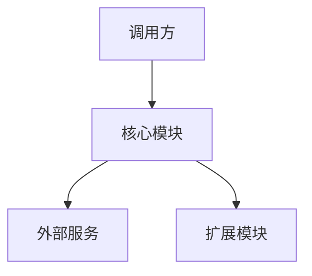
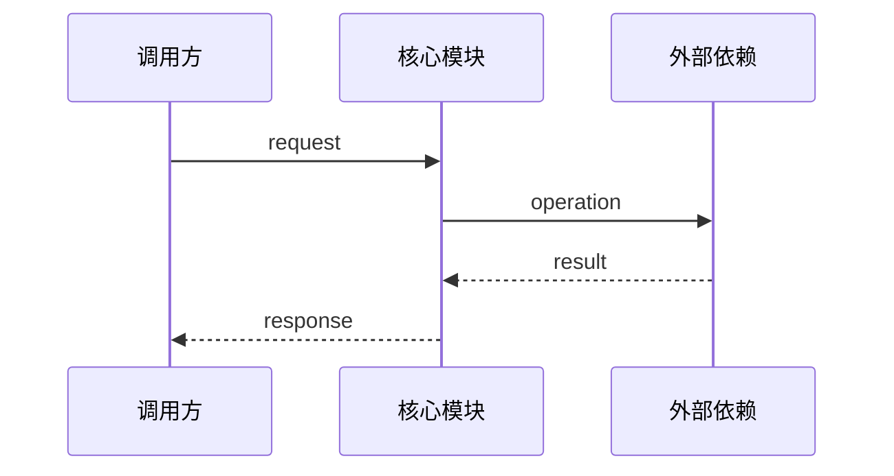

# [项目名称] 技术设计

## 1. 设计目标与约束

### 1.1 设计目标

说明本设计需要解决的技术问题：

- [目标 1]
- [目标 2]

### 1.2 相关架构约束

列出本设计需要满足的 ADR 条目。ADR 直接记录在本文件第 6 节：

- `ADR-001`：[约束摘要]
- `ADR-002`：[约束摘要]

### 1.3 设计边界

说明本设计覆盖哪些模块，以及明确不覆盖哪些内容。

## 2. 总体架构

### 2.1 架构概览

用文字说明整体分层、依赖方向和主要协作关系。

### 2.2 架构图



### 2.3 模块清单

| 模块 | 职责 | 依赖 | 暴露接口 |
| --- | --- | --- | --- |
| [模块名称] | [模块职责] | [依赖模块] | [公共接口] |

## 3. 模块设计

### 3.1 [模块名称]

#### 职责

说明模块负责什么，以及明确不负责什么。

#### 依赖

- [依赖模块或外部服务]

#### 核心接口

```python
class Example:
    ...
```

#### 输入与输出

| 项目 | 类型 | 说明 |
| --- | --- | --- |
| [输入或输出] | [类型] | [说明] |

#### 行为约束

- [约束 1]
- [约束 2]

#### 错误处理

| 错误场景 | 处理方式 | 对外表现 |
| --- | --- | --- |
| [场景] | [处理方式] | [异常、默认值或错误结果] |

复制本节结构描述其他模块。

## 4. 核心流程

### 4.1 [流程名称]



### 4.2 状态与数据流

说明关键数据从哪里产生、如何转换、由谁持有，以及在哪些边界进行序列化或校验。

## 5. 接口与数据模型

集中列出跨模块共享的接口和数据结构：

| 名称 | 类型 | 所属模块 | 公共/内部 | 用途 |
| --- | --- | --- | --- | --- |
| [名称] | [类、函数或模型] | [模块] | [公共/内部] | [用途] |

### 5.1 [接口或模型名称]

```python
class Example:
    ...
```

说明参数、返回值、异常和兼容性要求。

## 6. 关键设计决策（ADR）

### `ADR-001`：[决策标题]

- 背景：[需要解决的问题]
- 候选方案：
  - 方案 A：[说明]
  - 方案 B：[说明]
- 当前选择：[方案]
- 选择原因：[原因]
- 影响：[对实现和后续扩展的影响]
- 状态：[proposed/approved/verified/failed/waived/retired]
- 关联任务：[task.md 中的任务 ID]
- 验证证据：[命令、测试或记录路径]

## 7. 可扩展性设计

说明未来如何扩展，同时保持哪些接口稳定：

- [新增 Agent 类型]
- [新增 LLM 提供商]
- [新增工具]
- [替换存储或执行组件]

## 8. 非功能设计

记录设计层面的非功能要求：

- 可测试性：[设计方式]
- 可观测性：[设计方式]
- 错误隔离：[设计方式]
- 性能：[设计方式]
- 安全：[设计方式]
- 依赖控制：[设计方式]

公共接口契约应引用 `api_schema.yaml`，避免在此重复定义。架构决策和验证状态以本节为唯一来源。

## 9. 验证方案

说明如何验证设计能够落地。具体任务和执行进度记录在 `task.md` 中。

| 验证项 | 验证方式 | 通过标准 |
| --- | --- | --- |
| [接口或流程] | [单元测试/集成测试/手工运行] | [通过标准] |

## 10. 未决问题

记录尚未解决的设计问题：

- [问题 1]
- [问题 2]

没有未决问题时填写“无”。

## 11. 变更记录

| 版本 | 日期 | 变更内容 | 变更原因 |
| --- | --- | --- | --- |
| 0.1.0 | YYYY-MM-DD | 初始设计 | - |

## 12. 审阅记录

| 日期 | 审阅人 | 结论 | 备注 |
| --- | --- | --- | --- |
| YYYY-MM-DD | [姓名] | 待审阅/通过/需修改 | [备注] |
