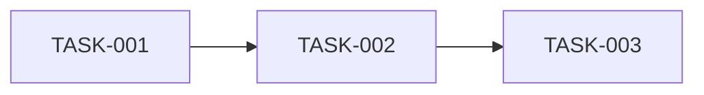

# [项目名称] 实施任务

## 1. 任务说明

### 1.1 当前阶段目标

说明当前这一轮任务要达成的结果。

### 1.2 任务范围

说明本次任务涉及哪些模块，并明确不包含哪些内容。

### 1.3 完成定义

说明整体任务何时可以标记为完成：

- [代码实现完成]
- [对应测试通过]
- [文档或验证证据已记录]
- [相关 ADR 决策已验证]

## 2. 任务清单

| ID | 任务 | 类型 | 优先级 | 依赖 | 状态 | 负责人 |
| --- | --- | --- | --- | --- | --- | --- |
| `TASK-001` | [任务名称] | implementation | P0 | - | todo | [姓名] |
| `TASK-002` | [任务名称] | test | P0 | TASK-001 | todo | [姓名] |

状态建议统一使用：

```text
todo        未开始
in_progress 进行中
blocked     被阻塞
review      等待审查
done        已完成
cancelled   已取消
```

类型可以使用：

```text
design
implementation
test
documentation
verification
refactor
```

## 3. 任务详情

### `TASK-001`：[任务名称]

- 类型：[design/implementation/test/...]
- 目标：[要完成什么]
- 前置依赖：[任务 ID 或无]
- 关联设计：[design.md 中的章节或决策 ID]
- 关联决策：[ADR ID]
- 输入：[依赖或前置材料]
- 输出：[代码、测试、文档或其他产物]
- 验收标准：
  - [可验证标准 1]
  - [可验证标准 2]
- 验证命令：

```powershell
[命令]
```

- 验证结果：[待验证/通过/失败]
- 证据：[测试输出、文件路径或运行记录]
- 当前状态：[todo]
- 备注：[补充说明]

复制本节结构描述需要跟踪的重点任务。

## 4. 依赖与执行顺序



说明任务之间的依赖关系和推荐执行顺序。

## 5. 验证记录

只记录实际发生的验证，不把计划中的验证写成已完成：

| 日期 | 任务 ID | 验证方式 | 结果 | 证据 |
| --- | --- | --- | --- | --- |
| YYYY-MM-DD | TASK-001 | pytest | 通过/失败 | [路径或输出摘要] |

## 6. 阻塞与风险

| ID | 关联任务 | 问题 | 影响 | 下一步 | 状态 |
| --- | --- | --- | --- | --- | --- |
| `BLOCK-001` | TASK-001 | [问题] | [影响] | [处理方式] | open |

解除阻塞后，补充解决方案和解决日期。

## 7. 变更记录

| 版本 | 日期 | 变更内容 | 变更原因 |
| --- | --- | --- | --- |
| 0.1.0 | YYYY-MM-DD | 初始任务清单 | - |

## 8. 审阅记录

| 日期 | 审阅人 | 范围 | 结论 | 备注 |
| --- | --- | --- | --- | --- |
| YYYY-MM-DD | [姓名] | [任务或阶段] | 待审阅/通过/需修改 | [备注] |
